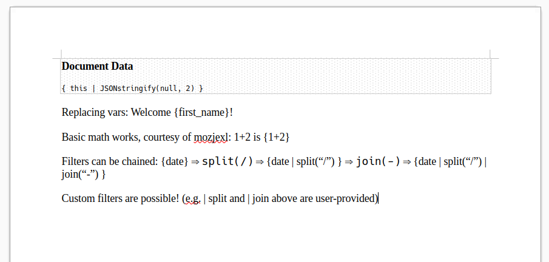
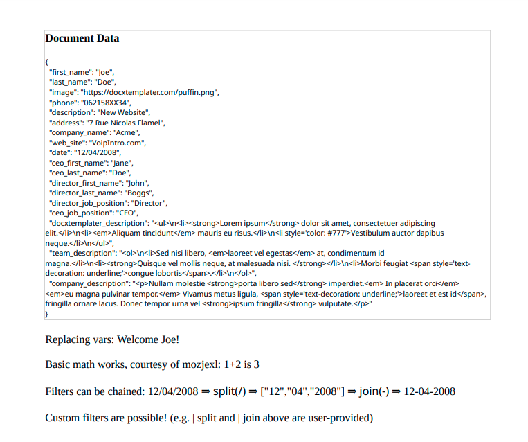
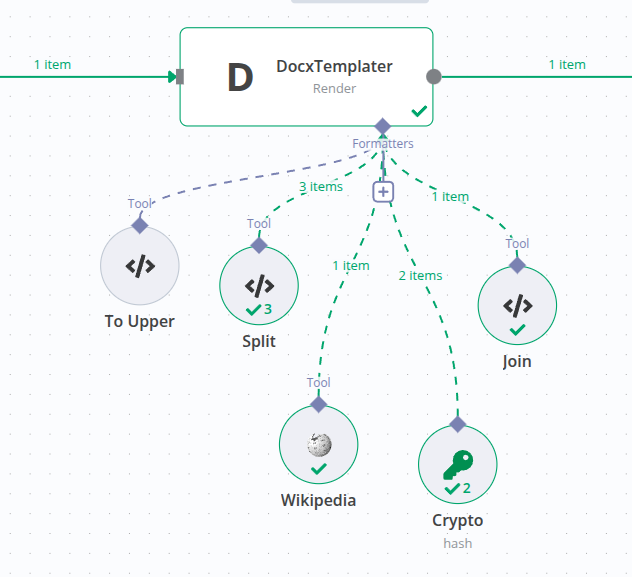
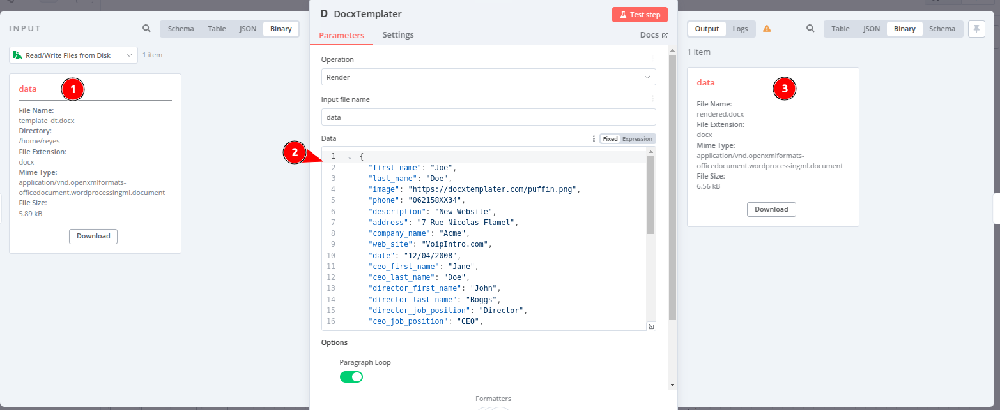
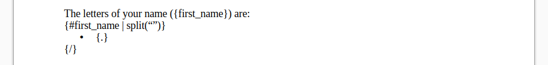
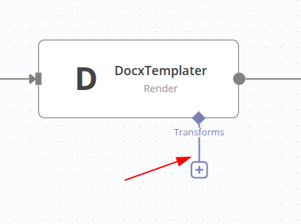
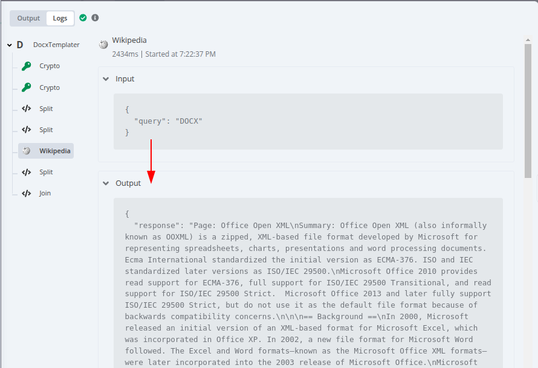
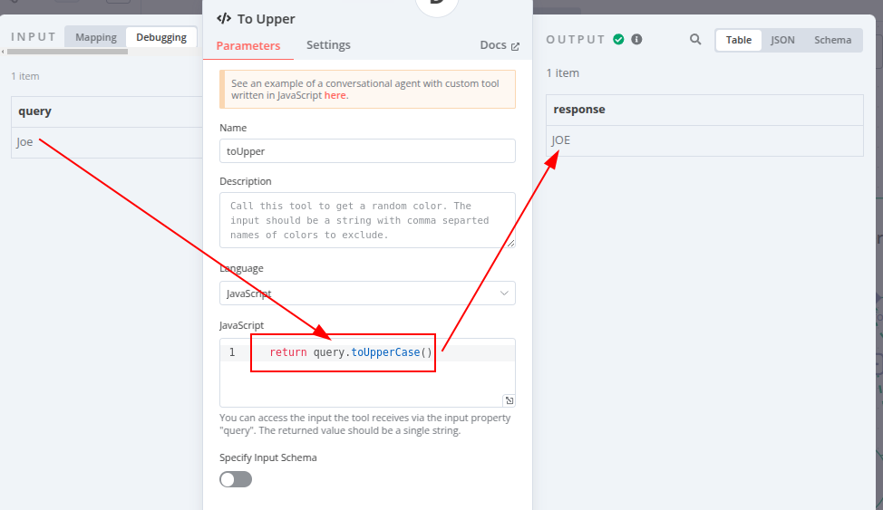
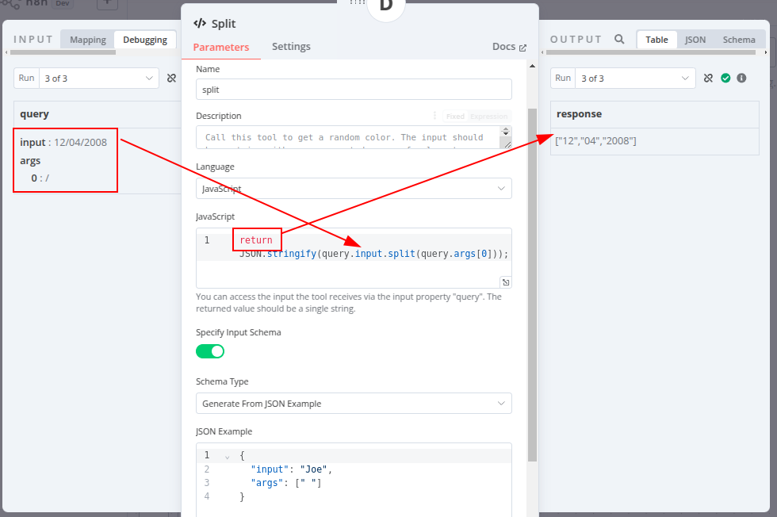
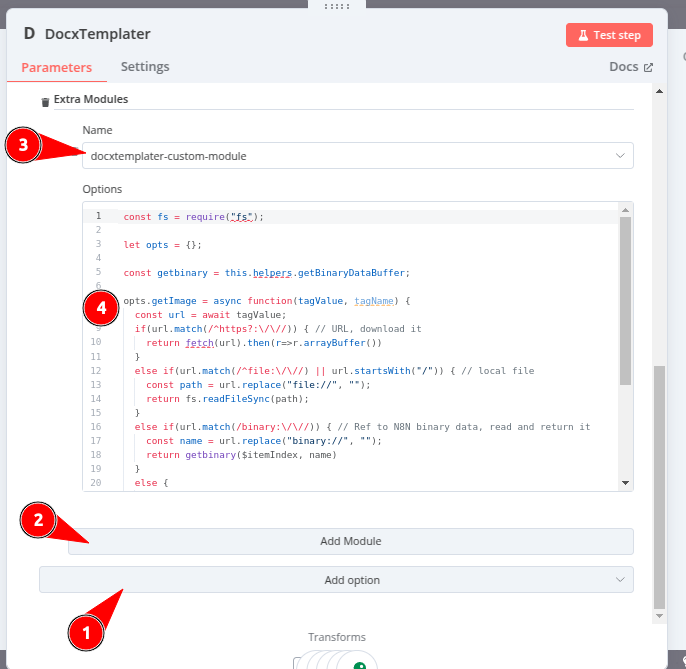

# n8n-nodes-docxtemplater

> [!TIP]
> If you're interested in generating documents using N8N from a Word/Excel/Powerpoint template, you may also be
> interested [in the `n8n-nodes-carbonejs` node](https://github.com/jreyesr/n8n-nodes-carbonejs), which
> uses [Carbone](https://carbone.io/) as the rendering engine.
>
> Carbone has a different syntax for filters/formatters and its node is simpler to use than this one, at the expense
> of less configurable functionality (no custom Transforms or data sources, no Modules)

This is an n8n community node. It lets you use [docxtemplater](https://docxtemplater.com/) in your n8n workflows.

[docxtemplater](https://docxtemplater.com/) is a library that generates DOCX, PPTX and XLSX documents from templates and
a database containing the custom data. This enables you to automate large-scale document generation efficiently.

The docxtemplater tags (e.g. `{ object.data | filter1 | filter2 }`) can
use [Jexl](https://github.com/TomFrost/Jexl?tab=readme-ov-file#all-the-details) syntax: binary operators such as +
and -, comparisons such as == or !=, and [transforms](https://github.com/TomFrost/Jexl?tab=readme-ov-file#transforms)
such as `| lower` that work like shell pipes.

This node lets you transform this template document:



into this document:



It also allows you to
use [N8N's Advanced AI Tool nodes](https://docs.n8n.io/integrations/builtin/cluster-nodes/sub-nodes/), like those that
are used to provide "Tool Calling" functionality on LLMs. These can be used to provide custom
formatters/filters/transforms that can transform data:



[n8n](https://n8n.io/) is a [fair-code licensed](https://docs.n8n.io/reference/license/) workflow automation platform.

[Installation](#installation)  
[Operations](#operations)
[Compatibility](#compatibility)  
[Usage](#usage)
→[Transforms](#render-transforms)
→[Docxtemplater Modules](#docxtemplater-modules)
→[Data Resolving](#data-resolving)
[Resources](#resources)  
[Version history](#version-history)

## Installation

Follow the [installation guide](https://docs.n8n.io/integrations/community-nodes/installation/) in the n8n community
nodes documentation.

## Operations

### Render

This operation receives a DOCX, PPTX or XLSX document (1), plus a "context" (a JSON document) (2), and outputs another
DOCX, PPTX or XLSX document (3). The input document can have "tags" such as `{ value }`, which will be replaced with the
corresponding data in the context.



With the context in the image above, it's possible to write tags like this (and, in
general, [anything else that is supported by Jexl, AKA Javascript Expression language](https://github.com/TomFrost/Jexl)
in the Word document:

* `{ first_name }`: Will simply be replaced by the corresponding JSON field, so the output document will contain `Joe`
* `{ first_name + " " + last_name }`: Will execute a string concatenation, so the output will be `Joe Doe`
* `{ first_name ? "Hello, " + first_name : "Hello!" }`: Supports
	the [ternary operator](https://github.com/TomFrost/Jexl?tab=readme-ov-file#ternary-operator) (if X then Y else Z), and
	special syntax for an operation similar to null-coalescing: `{ user.first_name ?: "Person" }`
* `{ first_name | uppercase }`: Will read the `first_name` property and then call
	a [transform](https://github.com/TomFrost/Jexl?tab=readme-ov-file#transforms) on it (must be implemented!
	See [below](#render-transforms)). This may output, if so implemented, `JOE` if `first_name` is `Joe`
* `{ positions["Chief of " in .title] }`: Will [filter the
	`positions` array](https://github.com/TomFrost/Jexl?tab=readme-ov-file#collections) array such that only positions
	that mention "Chief of ..." are kept
* `{ getUsers("ACTIVE") }`: Functions, with and without arguments,
	are [also supported](https://github.com/TomFrost/Jexl?tab=readme-ov-file#functions) at the top level (as the first
	element, not just as transforms after a pipe)

All these can be freely mixed with Docxtemplater syntax, such
as [loops](https://docxtemplater.com/docs/tag-types/#loops)
or [conditionals](https://docxtemplater.com/docs/tag-types/#conditions):



turns into


## Compatibility

This node has been developed on N8N v1.80.5. It should work with older versions as long as they
include [Tools for AI nodes](https://docs.n8n.io/integrations/builtin/cluster-nodes/sub-nodes/n8n-nodes-langchain.toolcode/).
If you encounter any problems, please [open an issue](https://github.com/jreyesr/n8n-nodes-docxtemplater/issues)!

## Usage

### Render Transforms

Since document tags (e.g. `{ some_field }`) in the template document use
the [Jexl](https://github.com/TomFrost/Jexl) format, they also
support [transforms](https://github.com/TomFrost/Jexl?tab=readme-ov-file#transforms)), expressed with the pipe |
character:

```
{ some_field | uppercase }
{ some_field | split(" ") }
{ some_field | lower | split(" ") }
```

Transforms work
like [Filters in the docxtemplater Angular parser](https://docxtemplater.com/docs/angular-parse/#filters), [formatters in Carbone](https://carbone.io/documentation/design/formatters/overview.html),
[pipes in Angular](https://angular.dev/guide/templates/pipes#)
or [in Unix shells](https://www.gnu.org/software/bash/manual/html_node/Pipelines.html), or filters in web frameworks
like [Jinja](https://jinja.palletsprojects.com/en/stable/templates/#filters)
or [Django](https://docs.djangoproject.com/en/5.1/ref/templates/builtins/#built-in-filter-reference): they receive a
piece of data as input, optionally some other parameters, and they output another piece of data that is usually some
sort of transformation of the input data.

Simple transforms take no arguments other than their input data:

```
{ some_field | uppercase }
```

The `| uppercase` transform reads its input, uppercases it (which implies that it should only be called on strings) and
returns the uppercased string.

Other transforms require parameters/arguments to further customize their behavior:

```
{ now | timeformat("yyyy-MM-dd HH:mm") }
```

Filters can be chained as long as the output of the previous filter can be used as the input to the next filter:

```
{ some_field | lower | split(" ") | first | length }
```

If `some_field` is a string, `| lower` receives it and outputs another string, a lowercased version of it.
`| split(" ")` can receive this string and split it into an array of strings. `| first` can receive this array and pick
out its first element, which will be a string. `| length` receives that string and returns a number, the count of
characters in the _first word_ of `some_field`.

#### Built-in transforms

The following transforms are bundled with this N8N node. Feel free
to [open an issue](https://github.com/jreyesr/n8n-nodes-docxtemplater/issues) if you know of other transforms that could
be useful to more people (for example, transforms that are commonly bundled with similar software):

* `| JSONstringify`: Receives any data and returns a string, the result of JSON-serializing it. Use if your output Word
	document displays data like `[Object object]` (that's the sign of a JS object trying to be converted to a string)
* `| JSONparse`: The opposite of `| JSONstringify`, reads in a string that should contain a JSON-encoded document and
	outputs the actual document. Use when the render data contains JSON-encoded data
* `| length`: Receives something that has a "length" (e.g. strings or arrays) and returns a number with the length of
	the data. If it's a string, the length is the number of characters. if it's an array, it's the number of elements

#### Custom transforms

This functionality is powered by N8N's Advanced AI "Tools" feature, normally used to provide "Tool Calling"
functionality to LLMs. Tools are sub-nodes that can be "provided" to a main node, and may be called by the main node if
necessary (e.g. when the LLM generates a tool call document while generating some text).

You can add your own custom transforms by attaching them to the Transforms connection point below the node:



These will be exposed as filters/transforms/pipe operators in the template document.

#### Built-in N8N Tools

N8N has many nodes that have been enabled to function as Tools, so they can be used with LLMs. These can all be used by
this node.

For example, the Wikipedia tool receives a piece of text, which should be the name of a Wikipedia article, and returns
Markdown text with the beginning of the article:



There are [many other tools](https://docs.n8n.io/integrations/builtin/cluster-nodes/sub-nodes/), such
as [Wolfram|Alpha](https://docs.n8n.io/integrations/builtin/cluster-nodes/sub-nodes/n8n-nodes-langchain.toolwolframalpha/)
and [Calculator](https://docs.n8n.io/integrations/builtin/cluster-nodes/sub-nodes/n8n-nodes-langchain.toolcalculator/)
that can run mathematical
operations, [HTTP Request](https://docs.n8n.io/integrations/builtin/cluster-nodes/sub-nodes/n8n-nodes-langchain.toolhttprequest/)
that can run arbitrary HTTP requests with the provided data, as well as many N8N nodes that have been tool-ified, such
as Airtable, Asana, AWS, Crypto, Discord, Facebook, Gmail, Linear, OneDrive, Postgres, S3, Slack, and many more.

#### Custom Code Tools

If your desired transform isn't available and is better expressed as a piece of code, you can use
the [Custom Code Tool](https://docs.n8n.io/integrations/builtin/cluster-nodes/sub-nodes/n8n-nodes-langchain.toolhttprequest/)
to implement a transform:

1. Add a new Custom Code tool to the Transforms
2. Give it a name, **all lower-case**, which will be the name of the transform (the `| transform_name`) with which it'll
	 be invoked
3. The Description can be left empty, it's useful when using tools for LLMs but this node doesn't use it
4. Pick a language, Javascript if possible (Python
	 [is less efficient and has some limitations](https://docs.n8n.io/integrations/builtin/core-nodes/n8n-nodes-base.code/#python)),
	 and I haven't tested it
5. Write code that reads from `query` or its sub-field `query.input`:
	* If the tool takes no additional arguments, such as `{ some_var | uppercase }`, it must read from `query` directly:
		`query` in the code will contain whatever value `some_var` has
	* If the tool takes additional arguments, such as `{ some_var | split(" ") }`, it must read the input data from
		`query.input` and the additional args from `query.args`. `query.args` is _an array_ where additional args are passed
		in order (in this example, it'll be a 1-element array `[" "]` whose single element is a string with a single space).
		Additionally, if the tool takes additional arguments, they will be exposed as `arg0`, `arg1` and so on (in other
		words, you can also access the first transform argument as `query.arg0`). This is provided to allow the use of
		tools that can't index into arrays, such as
		the [HTTP Request Tool](https://docs.n8n.io/integrations/builtin/cluster-nodes/sub-nodes/n8n-nodes-langchain.toolhttprequest/)
		that only accepts placeholders like `{arg0}` of type String, but not `{args.0}` or `{args[0]}` with `args` of type
		Array
6. In the code, perform whichever operations on the input data
7. **IMPORTANT** If using a transform that receives additional params, it's necessary to also enable the **Specify Input
	 Schema** switch, change **Schema Type** to **Generate From JSON Example** and provide a **JSON Example** that looks
	 like the actual data that will be provided:
	 	```json
			{
			 "input": "sample input",
			 "args": [" "]
		 }
		 ```
8. Return **a single string** from the code snippet. If you need to return a more complex object (e.g. an array or an
	 Object), call `JSON.stringify(...)` (for JS) on it before returning so it returns as a string
	* This won't affect chained transforms, such as `{ some_field | transformA | transformB }`: If `| transformA` is
		forced to stringify its return object, `| transformB` will receive the _real_ object as `query` or `query.input`

Example of a transform with no params, where the input can be accessed using the `query` name:



```
{ first_name | toupper }
```

Example of a transform with additional params, where the input can be accessed on `query.input` and the transform args
on `query.args[0]`, `query.args[1]` and so on. Notice that a custom Schema has been provided, informing N8N that this
transform receives a string as its main input and additionally one other parameter that is also a string:

```
{ date | split("/") }
```



### Docxtemplater Modules

This node supports [Docxtemplater modules](https://docxtemplater.com/modules/),
either [the Docxtemplater-provided paid modules](https://docxtemplater.com/pricing/), third-party modules, or (TODO)
modules that you write yourself.

Docxtemplater modules extend the functionality of Docxtemplater, such as
allowing [variable images](https://docxtemplater.com/modules/image/) with the syntax `{%fieldWithImagePath}`
or [raw HML](https://docxtemplater.com/modules/html/) with the syntax `{~~fieldWithHtml}`.

#### Installation

You first need to install the modules into the same Node.js environment used by N8N so they're available for importing.

In general, if you can successfully run `require("docxtemplater-module-name")` in a JS Code node, you should be able to
use it in this node.

> [!TIP]
> If you have already installed
> [NPM packages for the Code node](https://community.n8n.io/t/installing-additional-module-with-npm/11682),
> you can use that same workflow here, it should work (please raise an issue if not so I can add better instructions!).
> Otherwise, see below.

If using [the npm install](https://docs.n8n.io/hosting/installation/npm/) (native, no Docker), you can run
`npm install -g docxtemplater docxtemplater-module-name` (the same command
used [when installing N8N itself](https://docs.n8n.io/hosting/installation/npm/#install-globally-with-npm)) so the
modules are installed in a place where the node can reach them.

If using [the Docker install](https://docs.n8n.io/hosting/installation/docker/), you should probably use a custom
Dockerfile in which you run the `npm install -g docxtemplater docxtemplater-module-name` command,
as [outlined here](https://community.n8n.io/t/external-module-merge-multiple-pdfs-into-a-single-pdf/2633/2).

> [!NOTE]
> In either case, you **must** also install the `docxtemplater` package, not just the `docxtemplater-module-X` package
> for the module itself. Docxtemplater modules depend on `docxtemplater` the main package as a dependency, so they'll
> error out if it isn't installed

#### Configuration

1. Go to the node's advanced options (**Add option** button at the bottom of the node's config. Add the **Extra Modules
	 ** option
2. Click the **Add Module** button
3. Choose a module in the **Name** dropdown. It'll list packages that conform to the structure `docxtemplater*module*`
	 that are available in the same location as the N8N package itself (location varies per OS, and depending on whether
	 you're using NVM or straight NPM)
4. In the **Options** code editor, provide any configuration options that the module needs. This code needs to return an
	 Object
	* The module's docs should contain any required config. Look for the object that is passed as the first and only
		argument to the `new NameModule(...)` call
	* The default code simply creates an empty object `let opts = {}` and returns it
	* For instance, the [Footnotes module](https://docxtemplater.com/modules/footnotes/) requires no config, since its
		creation is done with `new FootnoteModule({})`. The default code works for this module
	* By contrast, the [Image module](https://docxtemplater.com/modules/image/#usage-nodejs) requires config (it's the
		`imageOptions` object in the sample code). Use the docs' code as a starting point
5. In the code editor, you can access the same context as in a Code node, such as `require(...)`ing Node modules, or
	 accesing `$item` and other execution variables

See example configuration below:



```js
const fs = require("fs");

let opts = {};

const getbinary = this.helpers.getBinaryDataBuffer;

opts.getImage = async function (tagValue, tagName) {
	const url = await tagValue;
	if (url.match(/^https?:\/\//)) { // URL, download it
		return fetch(url).then(r => r.arrayBuffer())
	} else if (url.match(/^file:\/\//) || url.startsWith("/")) { // local file
		const path = url.replace("file://", "");
		return fs.readFileSync(path);
	} else if (url.match(/binary:\/\//)) { // Ref to N8N binary data, read and return it
		const name = url.replace("binary://", "");
		return getbinary($itemIndex, name)
	} else {
		throw new Error(`Unable to handle image ${url}! URLs (http:// or https://) and local files (file:///path/to/file or /path/to/file) are supported.`);
	}
}

opts.getSize = function (img, tagValue, tagName) {
	return [150, 150];
}

return opts;
```

Note that:

* In this code window, it's possible to `require(...)` Node.js packages, subject to the
	usual [admin-configurable restrictions on which nodes can be imported](https://docs.n8n.io/hosting/configuration/configuration-examples/modules-in-code-node/)
* The [`fetch()` function](https://developer.mozilla.org/en-US/docs/Web/API/Window/fetch) is also available so HTTP
	requests can be made
* [Any variables and functions](https://docs.n8n.io/code/builtin/current-node-input/) that would be available in a Code
	node using JS and mode "Run once for each item" are also available here, such as `$item`, `$json`, `$binary`, [the
	`helpers` property of
	`IExecuteFuntions`](https://github.com/n8n-io/n8n/blob/d2dd1796a871ee41681acc44ad01dfb0bbd5eee1/packages/workflow/src/Interfaces.ts#L925),
	and [any properties of
	`IWorkflowDataProxyData`](https://github.com/n8n-io/n8n/blob/d2dd1796a871ee41681acc44ad01dfb0bbd5eee1/packages/workflow/src/Interfaces.ts#L1986)

### Data Resolving

Docxtemplater supports [async data resolving](https://docxtemplater.com/docs/async/), which means that it can fetch data
_in the middle of_ rendering the template. In a "normal" templating engine, data must be fetched _before_ the template
is rendered, and it must be passed (typically in the form of a JSON document) to the rendering step. This means that the
template can't control the data fetched, since when the template is read the data has already been fetched.

By contrast, Docxtemplater (and also [`docx-templates`, by Guillermo Grau](https://github.com/guigrpa/docx-templates),
and maybe other libraries) can allow the template to control the fetched data. In Docxtemplater, this is done by
[passing Promise-returning functions, or equivalently async functions, to the
`renderAsync` function](https://docxtemplater.com/docs/async/#code-for-async-data-resolution), where normally the
content of each tag is passed. Docxtemplater transparently awaits any Promise-containing tags such that they can be
referenced in the template as if they were normal, data-carrying tags.

## Resources

* [n8n community nodes documentation](https://docs.n8n.io/integrations/community-nodes/)
* <https://docxtemplater.com/docs/tag-types/>

## Version history

TODO

